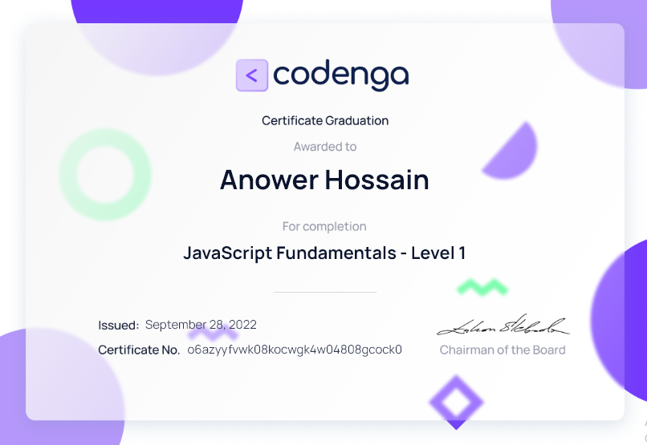
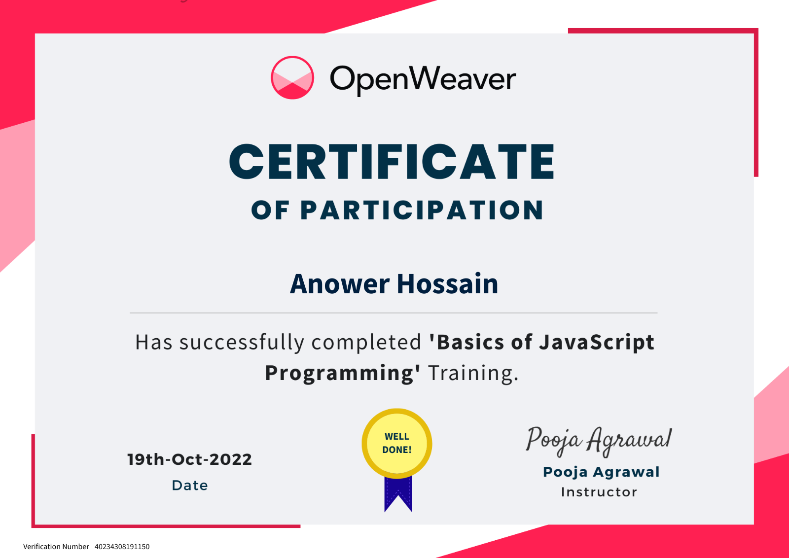
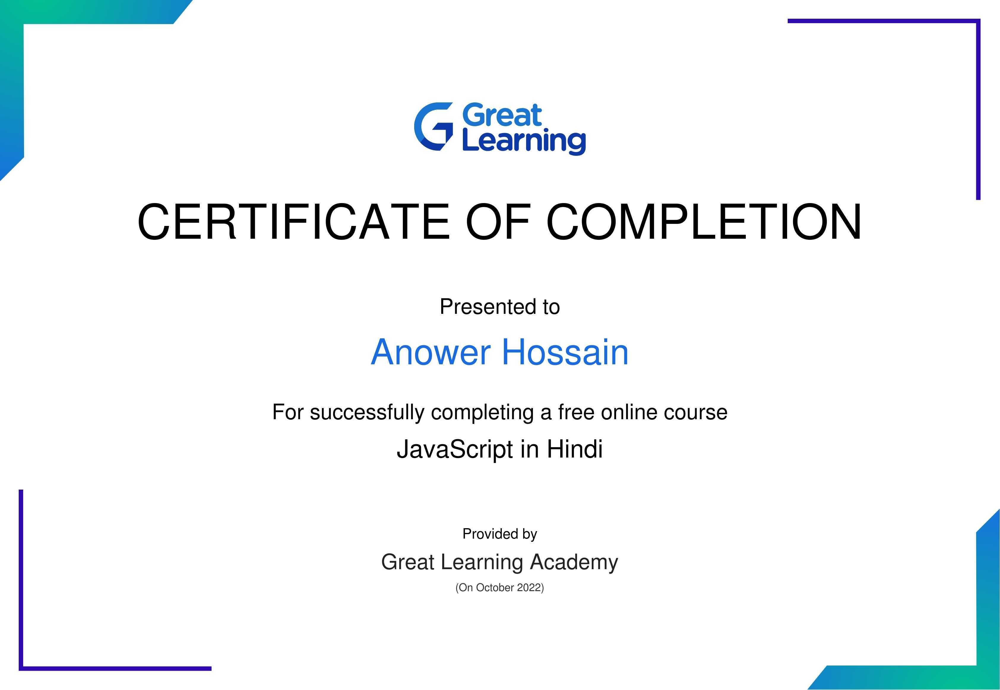
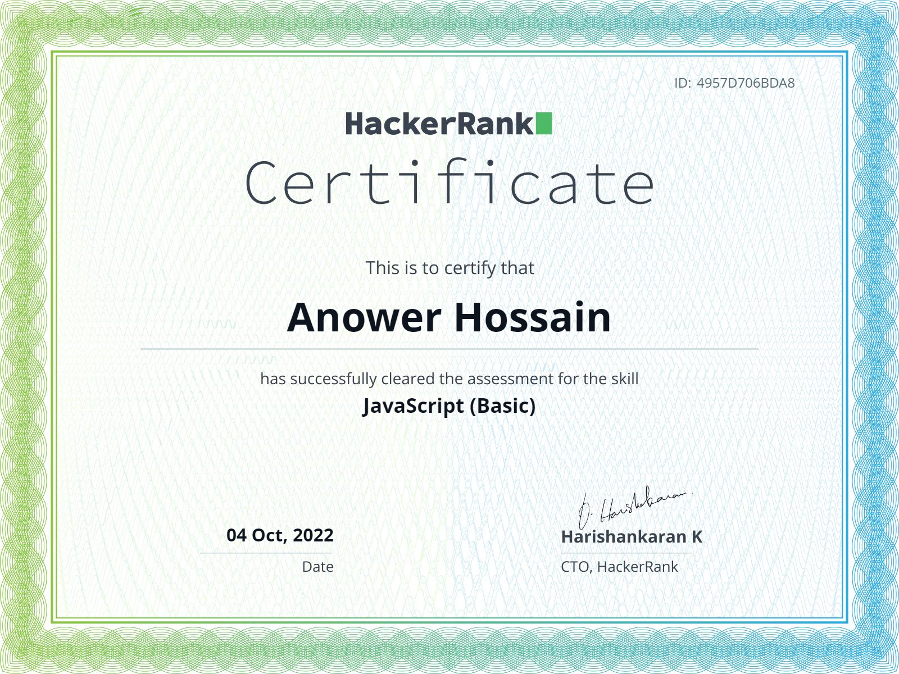
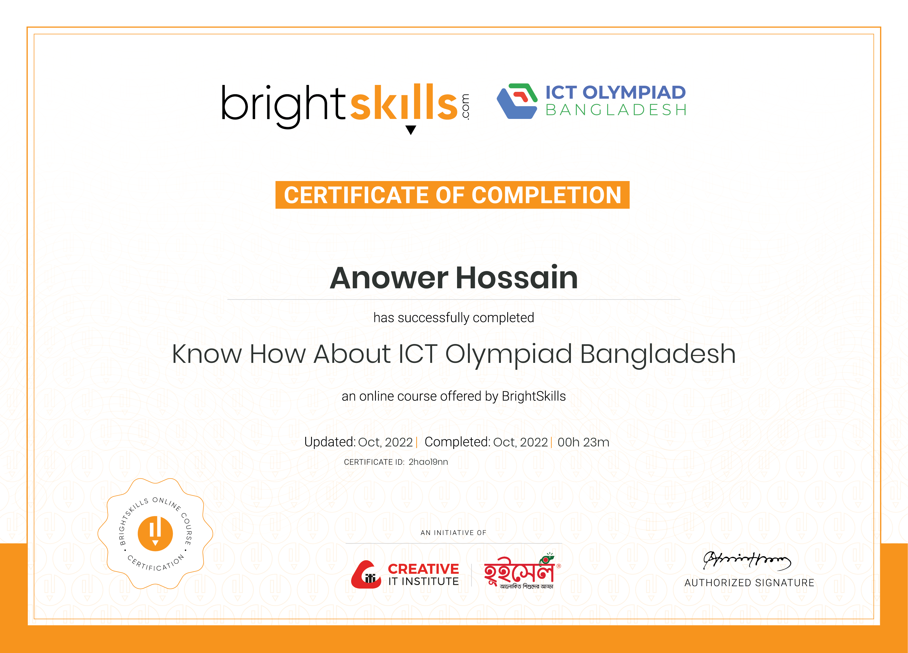
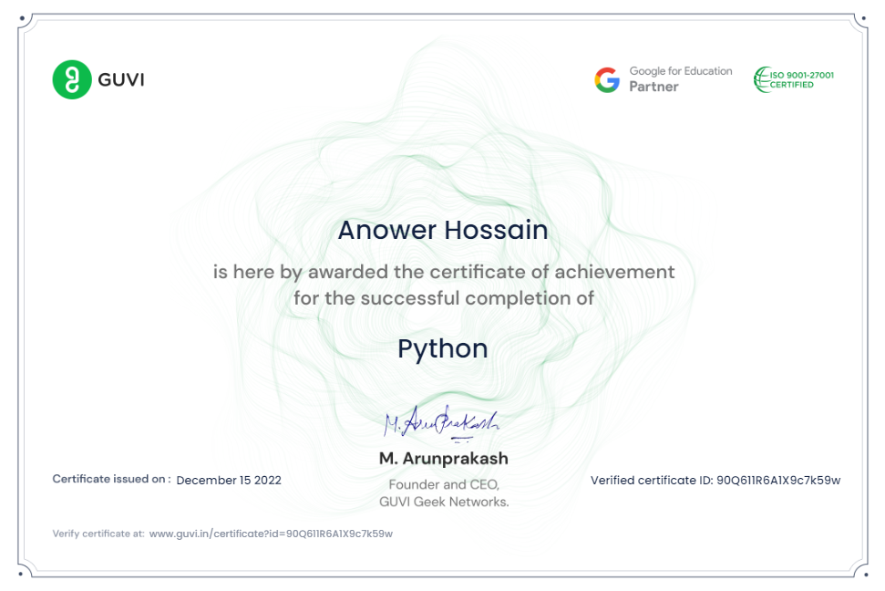
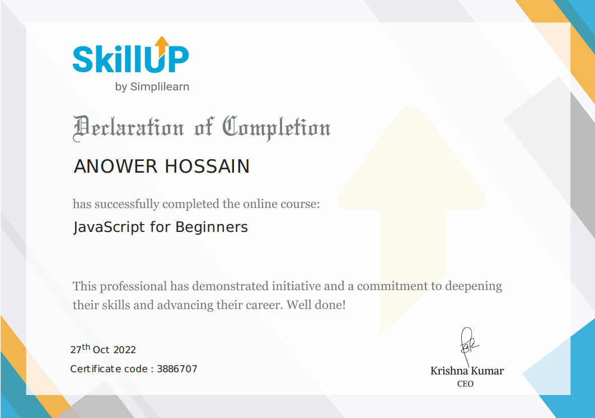

## __JavaScript Course__
___

```
```



```
```
### ### __Description__
<p style="font-size:20px">

I completed my javascript fundamental level-1 course. that is why I got a certificate from a `codenga` platform. It was a course to learn programming.
</p>

###  __Let's talk about the course__
___
<p style="font-size:15px">
The course is designed so you can learn by yourself, there are no tutorials and no documentation.
There are no resources in this course that you have to learn on your own. That's the beauty of this course, it's a different experience. Where you have no helper you must help yourself.
</p>

### __Website Link..__

#### [Check the certificate from the website](https://codenga.com/p/certificate/hash/o6azyyfvwk08kocwgk4w04808gcock0)


___

```


```


<!-- 2nd certificate -->

## __Basic Of JavaScript Programming__
___

```
```



```
```
### ### __Description__
<p style="font-size:20px">

I completed my Basic of javascript programming course. that is why I got a certificate from a `OpenWeaver` platform. It was a course to learn programming.
</p>

###  __Let's talk about the course__
___
<p style="font-size:15px">
The course is designed tutorial base and problem solving.
There are lot of resources in this course. it's a different experience. And several type of support team and big community.

</p>

### __Website Link..__

#### [Check the certificate from the website](https://certificates.openweaver.com/en/verify/72680741519139?ref=email)


___

```


```


<!-- 3rd certificate -->

## __Advance JavaScript__
___

```
```



```
```
### ### __Description__
<p style="font-size:20px">

I completed my Advance javascript programming course. that is why I got a certificate from a `Great Learning Academy` platform. It was a course to learn programming.
</p>

###  __Let's talk about the course__
___
<p style="font-size:15px">
The course is designed tutorial and problem solving and Assignment and also Examination Base.
Not a spacial resources in this course.But, Thera are lot of Experienced mentors several type of support team and big community.

</p>

### __Website Link..__

#### [Check the certificate from the website](https://olympus.mygreatlearning.com/certificates)


___

```


```


<!-- 4th certificate -->

## __Hacker Rank Certification__
___

```
```



```
```
### ### __Description__
<p style="font-size:20px">

I got this certificate after solving two problems after participate in a programming contest from `Hacker Rank` Problem solving platform. It was a contest to programming.
</p>

###  __Let's talk about the contest__
___
<p style="font-size:15px">
This platform is contest base platform. and there are lot of problem Beginner-like problems for beginners Advanced-type problems for advanced. It increases thinking power.
Thera are support team and big community here.

</p>

### __Website Link..__

#### [Check the certificate from the website](https://www.hackerrank.com/certificates/4957d706bda8)

___

```


```


<!-- 5th certificate -->

## __Bright Skills ICT OLYMPIAD__
___

```
```



```
```
### ### __Description__
<p style="font-size:20px">

I completed my Know How About ICT OLYMPIAD BANGLADESH-Course. that is why I got a certificate from a `brightskill` platform. This course to Organize by ICT OLYMPIAD.
</p>

###  __Let's talk about the course__
___
<p style="font-size:15px">
The present age is the age of technology. So acquiring skills in ICT is mandatory for the present generation. It is impossible to succeed in a career in today's era depending only on institutional education, technology skills are required for success. Therefore, ICT Olympiad Bangladesh is working to make the next generation a skilled population to reach the right knowledge about ICT at the grass root level. Know How About ICT OLYMPIAD BANGLADESH-Course to learn all the information related to ICT OLYMPIAD BANGLADESH mission, central, departmental, district team and ambassadors' duties and activities in detail.
</p>

### __Website Link..__

#### [Check the certificate from the website](https://brightskills.com/classroom/know-how-about-ict-olympiad-bangladesh)


___

```


```


<!-- 6th certificate -->

## __Python Programming Course__
___

```
```



```
```
### ### __Description__
<p style="font-size:20px">

I completed my Python Programming Course. that is why I got a certificate from a `GUVI` platform. It was a course to learn programming.
</p>

###  __Let's talk about the course__
___
<p style="font-size:15px">
The course is designed so you can learn by yourself, there are no tutorials and no documentation.
There are no resources in this course that you have to learn on your own. That's the beauty of this course, it's a different experience. Where you have no helper you must help yourself.
</p>

### __Website Link..__

#### [Check the certificate from the website](https://www.guvi.in/verify-certificate?id=90Q611R6A1X9c7k59w)


___

```


```


<!-- 7th certificate -->

## __JavaScript Course__
___

```
```



```
```
### ### __Description__
<p style="font-size:20px">

I completed my javascript for beginners course. that is why I got a certificate from a `simplilearn` platform. It was a course to learn programming.
</p>

###  __Let's talk about the course__
___
<p style="font-size:15px">
The course is designed so you can learn by yourself, there are no tutorials and no documentation.
There are no resources in this course that you have to learn on your own. That's the beauty of this course, it's a different experience. Where you have no helper you must help yourself.
</p>

### __Website Link..__

#### [Check the certificate from the website](https://simpli-web.app.link/e/fXSncQuo2vb)

